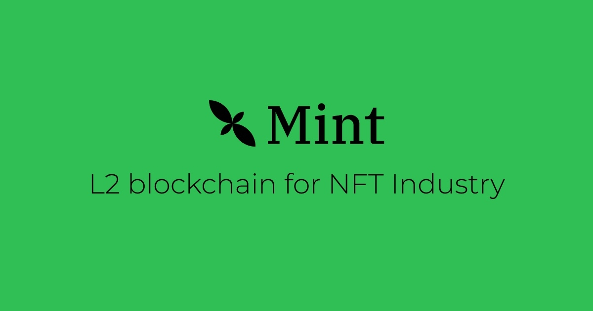

# Mint node

It currently supports Optimism’s open-source [OP Stack](https://stack.optimism.io/).

This repository contains the relevant Docker builds to run your own RPC node for Mint Blockchain.

### Fjord upgrade
```
The Fjord upgrade on Mint Mainnet will be activated 1720627201 Thu July 10 16:00:01 UTC 2024

The mint node is already support the upgrade.
```

Node operators need to update your client before the activation date.

step1: 
```
pull the latest op-geth-entrypoint and op-node-entrypoint, confirm already set --override.fjord=1720627201
```
step2: 
```
pull the latest releases of op-node and op-geth docker image
```
step3:
```
restart the node
```


[Details of Fjord upgrade](https://docs.optimism.io/builders/notices/fjord-changes)

| Network | op-node | op-geth |
| ------- | ------- | ------- |
| Mint Mainnet | v1.7.7 | v1.101315.2 |

### Software requirements

- [Docker](https://docs.docker.com/desktop/)
- [Python 3](https://www.python.org/downloads/)

### Hardware requirements

We recommend you have this configuration to run a node:

- at least 2 Core * 8 GB RAM
- an SSD drive with at least 100 GB free

### Networks Slug

| Network      | Slug                    | Status |
| ------------ | ----------------------- | :----: |
| Mint Sepolia | mint-sepolia-testnet-ijtsrc4ffq |   ✅   |
| Mint Mainnet | mint-mainnet-0          |   ✅   |

### Usage

1. Download the required network configuration(rollup.json and genesis.json) with Network Slug:

```
./download-config.py mint-mainnet-0
```

2. Copy `.env.example` to `.env`, ensure you have an Ethereum L1 full node RPC available:

* setting `OP_NODE_L1_ETH_RPC`. If running your own L1 node, it needs to be synced before the specific Conduit network will be able to fully sync.
* You also need a Beacon API RPC which can be set in `OP_NODE_L1_ETH_RPC`.

Example:
```
# .env file
OP_NODE_L1_ETH_RPC=https://eth-mainnet.g.alchemy.com/v2/<your key>
OP_NODE_L1_BEACON=<beacon api rpc>
```

3. Start the node!

```
docker compose up --build
```

4. You should now be able to `curl` your node:

```
curl -d '{"id":0,"jsonrpc":"2.0","method":"eth_getBlockByNumber","params":["latest",false]}' -H "Content-Type: application/json" http://localhost:8545
```

Note: Some L1 nodes (e.g. Erigon) do not support fetching storage proofs. You can work around this by specifying `--l1.trustrpc` when starting op-node (add it in `op-node-entrypoint` and rebuild the docker image with `docker compose build`.) Do not do this unless you fully trust the L1 node provider.

You can map a local data directory for `op-geth` by adding a volume mapping to the `docker-compose.yaml`:

```yaml
services:
  geth: # this is Optimism's geth client
    ...
    volumes:
      - ./geth-data:/data
```

### Snapshots

Not yet available. We're working on it

### Syncing

Sync speed depends on your L1 node, as the majority of the chain is derived from data submitted to the L1. You can check your syncing status using the `optimism_syncStatus` RPC on the `op-node` container. Example:

```
command -v jq  &> /dev/null || { echo "jq is not installed" 1>&2 ; }
echo Latest synced block behind by: $((($( date +%s )-\
$( curl -s -d '{"id":0,"jsonrpc":"2.0","method":"optimism_syncStatus"}' -H "Content-Type: application/json" http://localhost:7545 | jq -r .result.unsafe_l2.timestamp))/60)) minutes
```

### Network Stats

You can see how many nodes you are connected with the following command:

```
curl -d '{"id":0,"jsonrpc":"2.0","method":"opp2p_peerStats","params":[]}' -H "Content-Type: application/json" http://localhost:7545
```

### Troubleshooting

If you encounter problems with your node, please open a [GitHub issue](https://github.com/Mint-Blockchain/mint-node/issues) or reach out on our [Discord](https://discord.com/invite/mint-blockchain):
